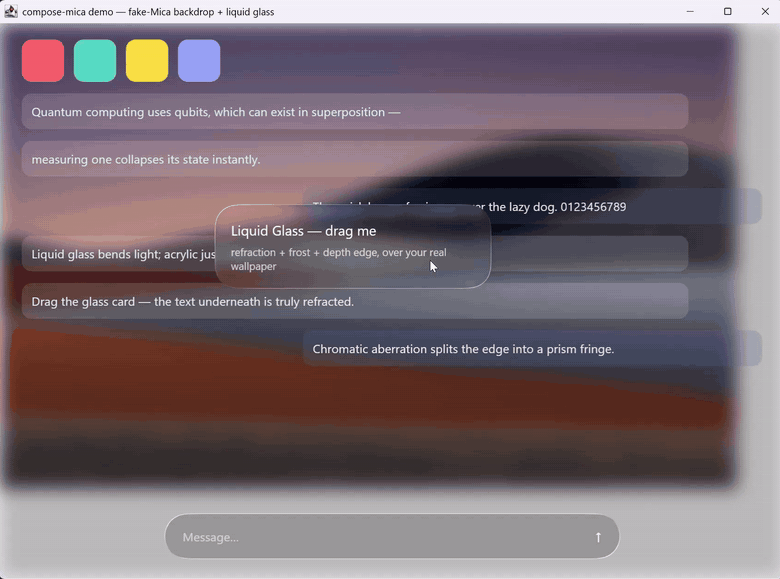

# compose-mica

A wallpaper-aware window backdrop for **Compose Desktop** — painted entirely in
Compose. It reads the real OS wallpaper, blurs and veils it in screen space, and
crops it to wherever the window currently sits, so the window's base layer is
tinted by the user's own desktop. On top of that it ships wallpaper-driven
theming and a recipe layer for liquid-glass surfaces.

No native code, no window-system hooks — everything is drawn inside Compose,
so it runs anywhere Skia does.



## What's inside

| Module | Contents |
|---|---|
| `:mica` | `SystemWallpaper` (registry wallpaper discovery + fill styles), `MicaWallpaperLayer` (position-tracked backdrop), `WallpaperLayer`/`WallpaperContentVeil` (custom wallpaper + adaptive dim), `WallpaperColorExtractor` (region-weighted palette), `AmbientBackdrop` (drifting fallback), `SystemTheme` (light/dark + reduced-motion hints) |
| `:glass` | `GlassSurface`/`GlassCapsule` recipe layer on top of the `backdrop` library — six usage tiers, press deformation via `layerBlock`, CSS `box-shadow`-compatible elevation |
| `:example` | Runnable demo: wallpaper-aware backdrop + draggable refractive glass card |

## How it works

- **Same signal source as the OS material.** The layer reads the actual
  wallpaper file (`HKCU\Control Panel\Desktop\Wallpaper`) and honours the
  user's fill style — change your wallpaper and the window changes with it.
- **Screen-anchored.** The wallpaper is laid out in screen coordinates and the
  window shows the slice it covers; moving the window re-crops, it never
  re-blurs.
- **Readability built in.** An adaptive dim curve
  (`effective = dim × (0.55 + luminance)`) darkens bright wallpapers harder
  than dark ones, and `WallpaperColorExtractor` produces per-region tints
  (top strip → topbar, left strip → sidebar, bottom-center → composer) so
  chrome picks up the wallpaper's hue.
- **Fails soft everywhere.** Non-Windows, no wallpaper set, unreadable file —
  each step degrades to an ambient gradient, never a black window or a crash.

## What it is not

This is a *visual equivalent*, not the compositor material: it does not sample
pixels through the window, and the blur/luminosity constants are empirical
(the OS blend has no public formula). That honesty is also what makes it
portable — the same code runs on any desktop OS.

## What we built vs. what we built on

- **The wallpaper/Mica pipeline is ours**: wallpaper discovery, screen-space
  layout and position tracking, the dim curve, the color extraction.
- **The glass module is a recipe layer** over Kyant's open-source
  `backdrop` library (`io.github.kyant0:backdrop-desktop`): the refraction
  engine is theirs; our tier parameters, press-deformation formula and effect
  ordering follow their documented examples. Credited in [NOTICE](NOTICE).

## Usage

```kotlin
// Behind everything, inside a layerBackdrop recording scope:
val surface = rememberSystemWallpaperSurface()
if (surface != null) {
    MicaWallpaperLayer(
        surface = surface,
        windowX = windowState.position.x.value,
        windowY = windowState.position.y.value,
        blurDp = 30f,
        veilAlpha = 0.35f,
    )
} else {
    AmbientBackdrop() // non-Windows, or no wallpaper set
}

// On top, any liquid-glass surface:
GlassSurface(backdrop = backdrop, tier = GlassTier.OVERLAY, cornerRadius = 28.dp) {
    /* content */
}
```

## Requirements

- Compose Desktop (JVM), Kotlin 2.x
- Windows for wallpaper/theme registry reads — every read fails soft, so the
  same code runs on macOS/Linux with the ambient backdrop
- `:glass` depends on `io.github.kyant0:backdrop-desktop` + `shapes-desktop`

## Run the demo

```bash
gradle :example:run
```

## License

Apache-2.0 — see [LICENSE](LICENSE) and [NOTICE](NOTICE).
